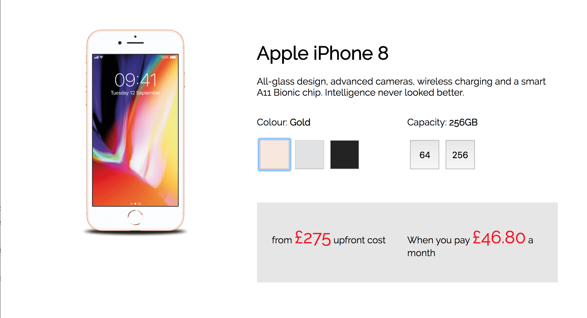

# Vodafone Tech Test

This app was built as the solution to a tech test set by Vodafone. The user interface displays a picture of a phone, along with information including price and memory capacity. Users can click on the colour and capacity buttons and the app will update the image and price.

#### My Approach

The test instructions emphasised the importance of making the code readable, concise and reusable. This led me to build my solution using React and a modular design.

My solution employs just one stateful component, `<Page />`, which renders several stateless functional components and funnels data to them as props. Clicking on the buttons changes state in the parent component, re-rendering the page.

The components are organised into separate files so they can be imported easily and are stateless, making them both reusable and maintainable.

#### Running the App
To run the app, simply clone this repo, `cd` into it in your terminal, then run `npm install` to install the dependencies and `npm start` to start the server. Finally, navigate to http://localhost:3000.

The components are fully unit tested using Jest and Enzyme. To run the tests use the `npm test` command.

#### Technologies Used
- JavaScript
- React
- CSS
- Jest
- Enzyme
